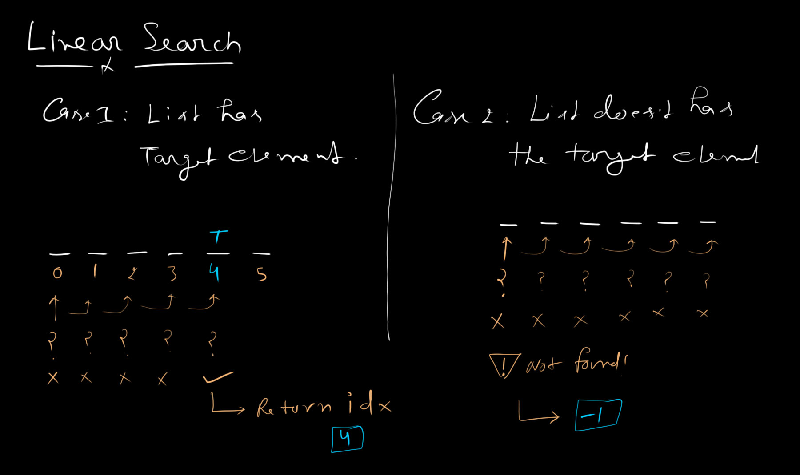

# 01. Linear Search

A simple, exhaustive sequential search over an array.

## Mathematical Complexities

- **Time Complexity:** $O(n)$ in the worst case, as every element may need to be visited.
- **Space Complexity:** $O(1)$ auxiliary space, since no additional scaling metadata is required.

