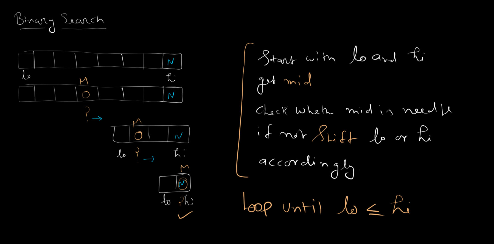

# 02. Binary Search

Binary Search is a highly efficient algorithm for finding an item from a **sorted** list of items. It works by repeatedly dividing the search space in half until the target element is found or the search space is exhausted.

> **⚠️ Prerequisite:** The array must be **sorted** before applying Binary Search.

## How it Works

1. **Initialize Pointers:** Set a `low` pointer to the first index (`0`) and a `high` pointer to the last index (`length - 1`) of the array.
2. **Loop Condition:** Continue searching as long as `low <= high` (the search space is valid).
3. **Calculate Midpoint:** Find the middle index: `mid = Math.floor((low + high) / 2)`.
4. **Compare:**
   - **Match:** If the element at `mid` is exactly the target, we found it! Return `true`.
   - **Too Large:** If the element at `mid` is greater than the target, the target must be in the left half. Narrow the search space by setting `high = mid - 1`.
   - **Too Small:** If the element at `mid` is less than the target, the target must be in the right half. Narrow the search space by setting `low = mid + 1`.
5. **Not Found:** If the loop terminates and the pointers cross over (`low > high`), the target does not exist in the list. Return `false`.

## Mathematical Complexities

- **Time Complexity:** $O(\log n)$ in the worst case, as the search space is halved at each step.
- **Space Complexity:** $O(1)$ auxiliary space, since no additional scaling metadata is required.

