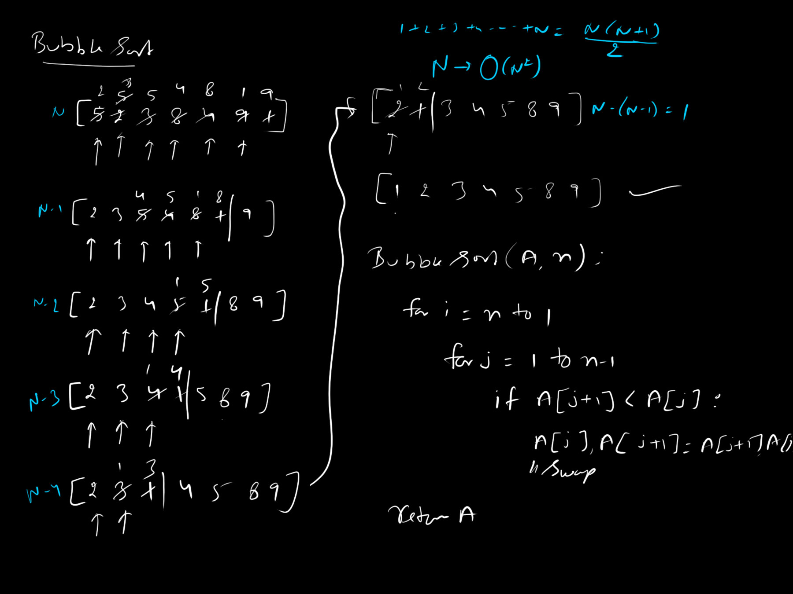

# Bubble Sort

Bubble Sort is often considered the simplest sorting algorithm. It operates on the principle of repeatedly stepping through the list, comparing adjacent elements, and swapping them if they are in the wrong order. The pass through the list is repeated until the list is sorted.

> *Someone once joked that if your airplane is falling out of the sky, Bubble Sort is the only sorting algorithm you'd have time to write from memory!*

## Mathematical Complexities

- **Time Complexity:** $`O(n^2)`$. In the worst case (a reversely sorted array), we must perform $`n`$ iterations, and $`n`$ comparisons within each iteration.
- **Space Complexity:** $`O(1)`$. The algorithm sorts the array perfectly in-place, requiring no auxiliary mathematical structures or memory allocations.

## Approach

1. Iterate over the array from the first element to the last.
2. Compare the current element with the next adjacent element.
3. If the current element is strictly greater than the next element, swap them.
4. After each full iteration, the absolute largest unsorted element "bubbles" up to its mathematically correct terminal position at the end of the array.
5. Repeat the process for the remaining unsorted elements until no swaps occur.

