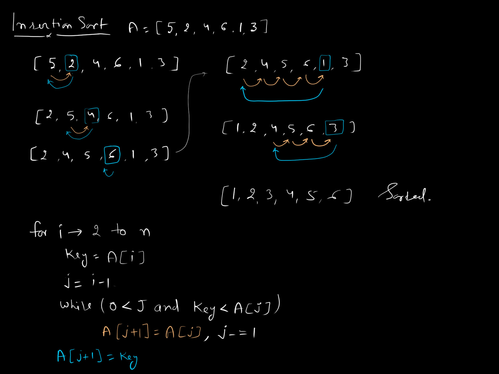

# 04. Insertion Sort

Insertion Sort is a simple and intuitive sorting algorithm that builds the final sorted array one item at a time. It works similarly to the way you might sort playing cards in your hands.

## How it Works

1. **Start:** Assume the first element (index `0`) is already sorted. Move to the second element (index `1`).
2. **Pick and Compare:** Take the current element (let's call it the "key") and compare it to the elements in the sorted portion to its left, moving right to left.
3. **Shift Elements:** If a compared element is larger than the key, shift that element one position to the right to make space.
4. **Insert:** Once you find an element smaller than the key (or reach the far left of the array), insert the key into that open position.
5. **Repeat:** Move to the next element in the unsorted portion and repeat steps 2-4 until the array is fully sorted.

## Mathematical Complexities

- **Time Complexity:**
  - **Best Case:** $O(n)$ when the array is already sorted (only one comparison per element and no shifting).
  - **Worst / Average Case:** $O(n^2)$ when the array is in reverse order or random (requires shifting all sorted elements for each new insertion).
- **Space Complexity:** $O(1)$ auxiliary space, since sorting is performed entirely in-place.

