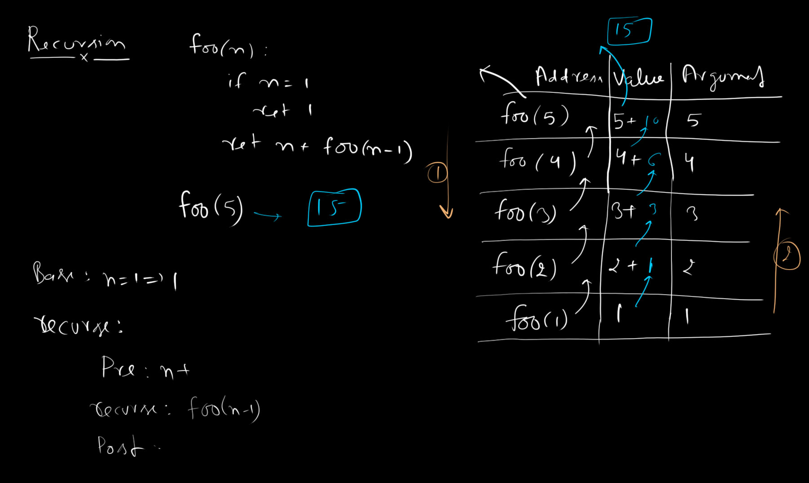
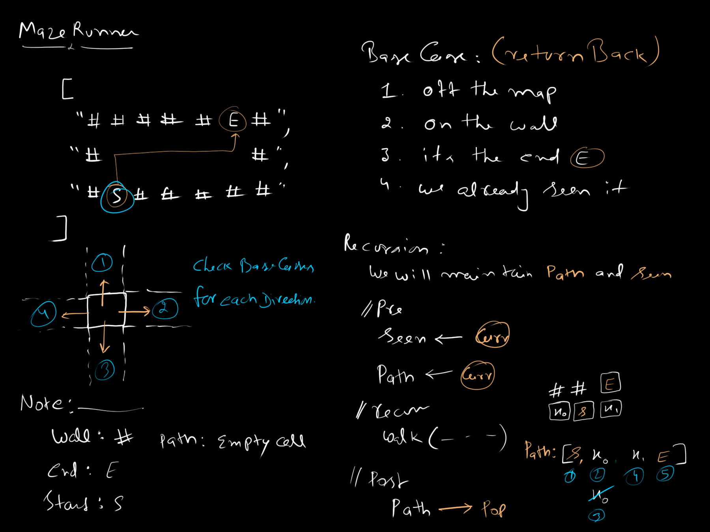

# Recursion: Maze Solver

The simplest way to think of recursion is a function that calls itself until a problem is solved. At its core, recursion is about defining a process in terms of a smaller version of itself. 

To prevent an infinite sequence, every recursive function **must** have at least one **Base Case**—a condition where the function stops calling itself and instead returns a computed value.

## The Call Stack

Before implementing recursion, it is critical to understand the **Call Stack**. When a function is invoked, the execution environment creates a frame containing:
1. **Return Address**: Where execution will resume after the function finishes.
2. **Arguments**: The input parameters passed to the function.
3. **Local Variables**: Any memory allocated within the function.

When a function calls itself, it pushes a new frame onto the call stack. Once a base case is hit, the stack begins to **unwind**, returning values up the chain.

## Recursive Function Architecture

A robust recursive algorithm is built in two primary phases:

### 1. Base Cases
Establishing clear and mathematically sound boundary conditions. Without comprehensive base cases, recursion results in stack overflows (`RangeError` or `RecursionError`).

### 2. The Recurse Step
This step is further subdivided into three distinct operations:
- **Pre-operation**: Logic executed *before* diving deeper (e.g., marking a node as visited, adding an element to a path array).
- **Recursion**: The actual self-invocation with a reduced or modified input set.
- **Post-operation**: Logic executed *after* returning from the recursive call (e.g., backtracking, removing an element from a path array).



---

## Applied Problem: Maze Solver

**Objective**: Given a 2D array representing a maze, find a valid path from a `start` coordinate to an `end` coordinate. The maze consists of walls (`#` or `x`) and empty passable spaces (` `).

### Example Vector
```json
{
  "maze": [
    "xxxxxxxxxx x",
    "x        x x",
    "x        x x",
    "x xxxxxxxx x",
    "x          x",
    "x xxxxxxxxxx"
  ],
  "wall": "x",
  "start": { "x": 10, "y": 0 },
  "end": { "x": 1, "y": 5 }
}
```

### Approach: Depth-First Search (DFS)
We can solve this by exploring the maze recursively. From any given point, there are up to four possible moves (Up, Right, Down, Left).

```text
    ①
    ↑
④ ← □ → ②
    ↓
    ③
```

To ensure we traverse properly and don't enter an infinite loop ping-ponging between two adjacent spaces, we define rigorous base cases and maintain a history of where we have been (`seen` matrix) and our current trajectory (`path`).

#### Base Cases
At every coordinate, we evaluate the following to determine if we must immediately return:
1. **Off the Map**: Is the current $`x`$ or $`y`$ outside the bounds of the maze grid?
2. **On a Wall**: Is the character at the current coordinate equal to the `wall` string?
3. **Already Seen**: Have we previously visited this coordinate? (If so, we're looping).
4. **The End Point**: Does the current coordinate equal the `end` point? If yes, we successfully found a path!

#### The Recurse Step
If none of the base cases are triggered, we execute the recursive traversal:
1. **Pre-operation**: Add the current coordinate to the `path` and mark it as `true` in our `seen` matrix.
2. **Recursion**: Recursively call the solver for all four adjacent directions (Up, Right, Down, Left). If any recursive branch returns a successful path, immediately return that path.
3. **Post-operation**: If all four directions fail, we have hit a dead-end. We **backtrack** by popping the current coordinate off the `path` array.



---

## Complexity Analysis

- **Time Complexity**: $`O(V)`$, where $`V`$ is the total number of vertices (cells) in the maze. In the absolute worst case, we visit every cell exactly once before determining no path exists or finding the end.
- **Space Complexity**: $`O(V)`$, bounded by the dimensions of the maze. This accounts for the `seen` boolean matrix and the maximum depth of the Call Stack (the `path` array), both of which will never exceed the total number of cells in the maze.
