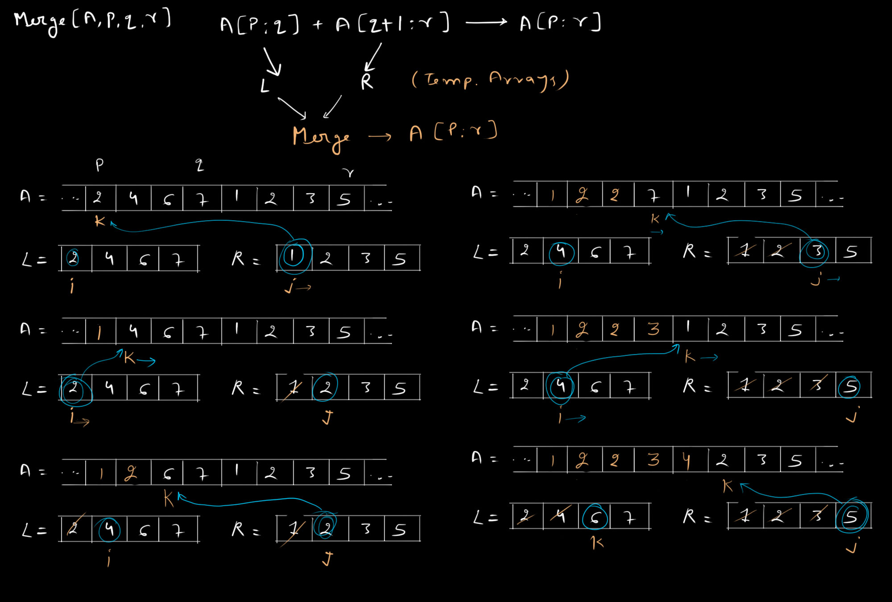
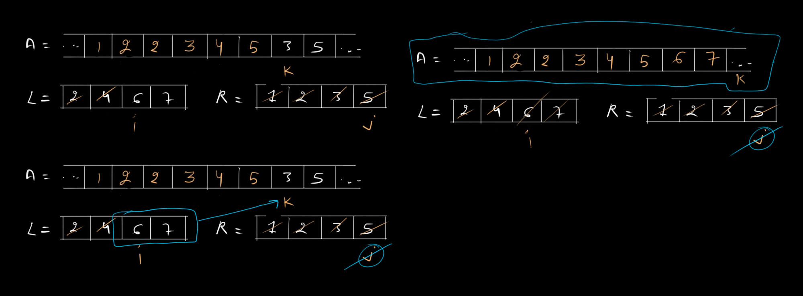

# Merge Sort

Merge-Soft algorithm closely follows the divide and conquer method. In each step, it sorts a subarray `A[p:r]`, starting with the entire array `A[1:n]` and recursing down to smaller and smaller subarrays. Here is how Merge-Sort operates.

1. **Divide** the subarray `A[p:r]` to be sorted into two adjacent subarrays, each of half the size. To do so, compute the midpoint `q` of `A[p:r]` (taking the average of `p` and `r`), and divide `A[p:r]` into subarray `A[p:q]` and `A[q+1:r]`.
2. **Conquer** by sorting each of the two subarrays `A[p:q]` and `A[q+1:r]` recursively using merge sort.
3. **Combine** by merging the two sorted subarrays `A[p:q]` and `A[q+1:r]` back into `A[p:r]`, producing the sorted answer.

So the critical part of this algorithm is Merging to arrays into one.

