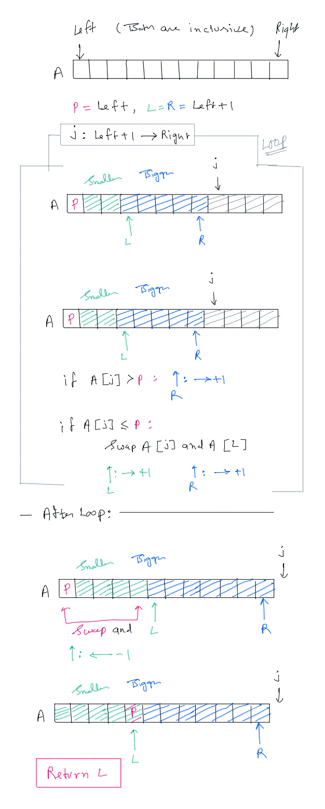

# QuickSort

QuickSort introduces a critical shift in memory governance. It operates strictly via in-place memory mutation, eliminating the $O(n)$ auxiliary memory allocation required by Merge Sort. The time complexity averages $O(n \log n)$. However, a poorly calibrated pivot mechanism degrades execution to $O(n^2)$, creating a severe computational liability for large datasets.

## Divide and conquer without merging

- Suppose the median of $L$ is $m$
- Move all values $<=m$ to left half of $L$
    - Right half has values $>m$
- Recursively sort left and right halves
    - $L$ is now sorted, no merge!
- Recurrence: $T(n) = 2T(n/2) + n$
    - Rearrange in a single pass, time $O(n)$
- So $T(n)$ is $O(n\log{n})$

### But How do we find the median?

- Sort and pick up the middle element. But our aim is to sort the list! This way it will become egg and chicken problem.
- Instead pick any value in $L$ - **pivot**. Then split $L$ with respect to the pivot element

## Quicksort Algorithm

- Choose a pivot element. Typically the first element in the array
- Partition $L$ into Lower and upper parts with respect to the pivot
- Move the pivot between the lower and upper partition
- Recursively sort the two partitions

See the below diagram for more details



## Partition Example

- $P$ → Pivot
- $[P:L)$ → smaller than Pivot
- $(L:R)$ → larger than Pivot
- $i$ → current element in process of evaluation

```
arr = [43, 32, 22, 78, 63, 57, 91, 13]
left = 0
upper = len(arr)

def partition(arr, left, upper):
    P = left
    L, R = left + 1

    for i -> [left+1:R)

-------------- Loop started ---------------

 P   i
 ↓   ↓
43, 32, 22, 78, 63, 57, 91, 13    |  [i]<=[P]: L,R,i -> and swap([i], [L])
    ↑↑
    LR

 P       i
 ↓       ↓
43, 32, 22, 78, 63, 57, 91, 13    |  [i]<=[P]: L,R,i -> and swap([i], [L])
        ↑↑
        LR

 P           i
 ↓           ↓
43, 32, 22, 78, 63, 57, 91, 13    |  [i]>[P]: R,i ->
            ↑↑
            LR


 P               i
 ↓               ↓
43, 32, 22, 78, 63, 57, 91, 13    |  [i]>[P]: R,i ->
            ↑    ↑
            L    R

 P                   i
 ↓                   ↓
43, 32, 22, 78, 63, 57, 91, 13    |  [i]>[P]: R,i ->
            ↑        ↑
            L        R

 P                       i
 ↓                       ↓
43, 32, 22, 78, 63, 57, 91, 13    |  [i]>[P]: R,i ->
            ↑            ↑
            L            R

 P                           i
 ↓                           ↓
43, 32, 22, 78, 63, 57, 91, 13    |  [i]<=[P]: L,R,i -> and swap([i], [L])
            ↑                ↑
            L                R

 P                             i
 ↓                             ↓
43, 32, 22, 13, 63, 57, 91, 78 ]   |  Loop ended
                 ↑             ↑
                 L             R


-------------- Loop ended ---------------

 P
 ↓
43, 32, 22, 13, 63, 57, 91, 78 ]   |  swap([P], [L-1]), P = L-1
                 ↑             ↑
                 L             R

            P
            ↓
13, 32, 22, 43, 63, 57, 91, 78 ]   |  swap([P], [L-1]), P = L-1
                 ↑             ↑
                 L             R

Return -> P

```


## q_sort Logic

```
arr = [43, 32, 22, 78, 63, 57, 91, 13]

q_sort(arr, start:0, end:len(arr)):
    if start < end:
        pivot = partition(arr, start, end)
        q_sort(arr, start, pivot-1)
        q_sort(arr, pivot+1, end)

```
## quick_sort Logic

```
quick_sort(arr):
    q_sort(arr, 0, len(arr))

```
