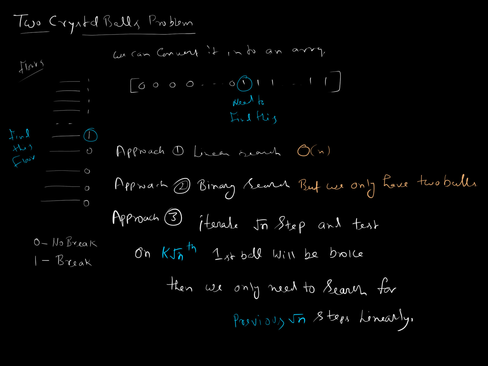
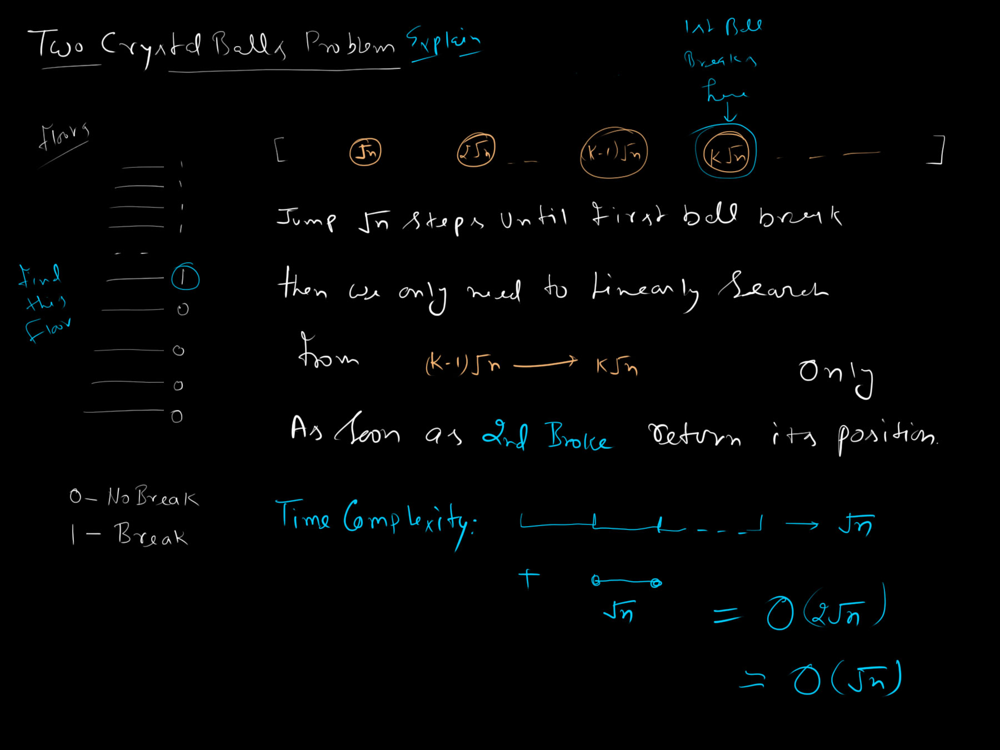
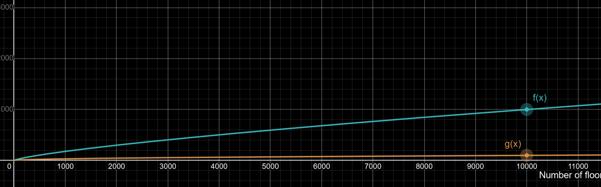

# Two Crystal Balls Problem

You have two identical crystal balls and a 100-story building. There is some floor $`f`$ where dropping a ball will break it, and it will break from any floor $\ge f$. Assuming that you can reuse the balls that do not break, find this floor $`f`$ using the minimum number of drops in the worst case.

## Intuitive Modeling

We can consider the total number of floors as $`n`$. If we denote all floors equivalent to their ability to break the ball by `0` (does not break) and `1` (breaks), we see the floors eventually forming a boolean array:

`[0, 0, ..., 0, 1, 1, ..., 1, 1]`

Here, we just need to find the index of the first `1` (or `true`) value.

## Approach 1: Linear Search

We can throw one ball from each floor sequentially from the 1st to the $`n`$-th floor until it breaks. The floor where it breaks is the answer.
- **Time Complexity:** $`O(n)`$. We can do better.

## Approach 2: Binary Search

As we can see that the equivalent array is actually in sorted order. i.e. starting with `0` and then `1`. so, its' intuitive to think about binary search.

Suppose there are 100 floors. According to the binary search algorithm, we first try to throw the ball from the 50th floor. If it breaks, our remaining search space is floors 1 through 49, but we now only have **one** ball left. Since we cannot perform binary search with only one ball (if it breaks again on floor 25, we lose our last ball and can never find the exact floor), this approach is fundamentally invalid.

## Approach 3: $`\sqrt{n}`$ Jumps

We can jump by $`\sqrt{n}`$ floors from the beginning until the first ball breaks. At this point, we are certain that the first breaking floor must be between the previous jump and the current jump.

1. Jump by $`\sqrt{n}`$ increments until a break is detected (Ball 1 breaks).
2. Iterate sequentially from the previous jump to the current jump using the remaining ball (Ball 2 drops).

```text
[0, 0, ..., 0, 1, 1, ... 1, 1]
      ↑      ↑      ↑...
             └──────┘
```

- **Number of jumps (Worst Case):** $`\sqrt{n}`$
- **Linear search (Worst Case):** $`\sqrt{n}`$
- **Total Time Complexity:** $`\sqrt{n} + \sqrt{n} = O(\sqrt{n})`$

Suppose there are a total of 100 floors. The $`\sqrt{100} = 10`$. So, we jump $`10`$ floors in each step until first ball breaks. As soon as the first ball breaks, we know that the breaking point is within previous step and the current step. Then we linearly search within that context (it's length is also $`\sqrt{100} = 10`$).

So, the maximum steps would be $`10 + 10 = 20`$.





## Why Not a Cube Root?

Let's analyze the time complexity when jumping by $`\sqrt[3]{n}`$.

- Total jumps: $`n / \sqrt[3]{n} = n^{2/3}`$
- Linear iteration: $`\sqrt[3]{n}`$

Although the linear iteration is reduced, the total jumps significantly increase. Because $`n^{2/3} > n^{1/2}`$, stepping by the cube root yields worse Big-O performance than stepping by $`\sqrt{n}`$. Thus, $`O(\sqrt{n})`$ minimizes the worst-case drop count.

Below is the comparison graph between $`f(x) = x^{1/3}`$ and $`g(x) = x^{1/2}`$



Above you can easily see the difference.
